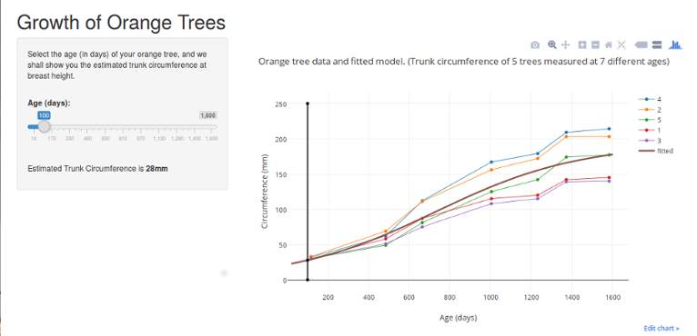

## Overview

- Demonstrates how a simple nonlinear least squares prediction model can be fitted
in R.
- The application tries to estimate the size of an orange tree given the age.
- Input is the age measured in days and output is the trunk circumference (mm).
- Features an interactive graph panel that displays the training data as well as the fitted model.



---

## Dataset

- The Orange dataset in R `nlme` package is used to train the predictor
- The trunk circumference of 5 trees is measured at 7 different  ages
- Data frame consists 35 rows of records of the growth containing 3 columns:
    * Tree: an ordered factor indicating the tree on which the measurement is made.
    * age: a numeric vector giving the age of the tree in days
    * circumference: a numeric vector of "trunk circumferences at breast height" (mm) commonly used by foresters.


```r
head(Orange)
```

```
##   Tree  age circumference
## 1    1  118            30
## 2    1  484            58
## 3    1  664            87
## 4    1 1004           115
## 5    1 1231           120
## 6    1 1372           142
```

---

## Prediction Model

- Non linear logistic regression model.
- The R `nls` function is used to determine the nonlinear (weighted) least-squares estimates of the parameters of the model.
- Unlike in the linear case, the parameters must be declared explicitly in a nonlinear model formula. `SSlogis` function is used to determine the self starting estimates.


```r
fit <- nls(circumference ~ SSlogis(age, Asym, xmid, scale), data = Orange)
fit
```

```
## Nonlinear regression model
##   model: circumference ~ SSlogis(age, Asym, xmid, scale)
##    data: Orange
##  Asym  xmid scale 
## 192.7 728.8 353.5 
##  residual sum-of-squares: 17480
## 
## Number of iterations to convergence: 0 
## Achieved convergence tolerance: 3.56e-06
```

---

## Prediction Model (contd)


```r
library(ggplot2)
g <- qplot(age, circumference, data = Orange, geom = c("point", "line"), 
           color = Tree, xlab = "Age (days)", ylab = "Circumference (mm)",
           main = "Growth of Orange Trees")
age <- seq(0, 1600, length.out = 101)
g <- g + geom_line(aes(x = age, y = predict(fit, list(age = age))), 
                   size = 2, color = "#7777FF")
g
```

 

